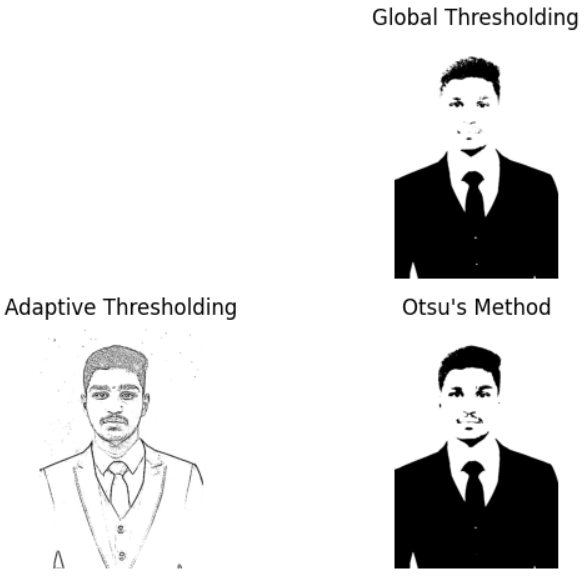

# THRESHOLDING
## Aim
To segment the image using global thresholding, adaptive thresholding and Otsu's thresholding using python and OpenCV.

## Software Required
1. Anaconda - Python 3.7
2. OpenCV

## Algorithm
### Step1:
Load the necessary packages.
### Step2:
Read the Image and convert to grayscale.
### Step3:
Use Global thresholding to segment the image.
### Step4:
Use Adaptive thresholding to segment the image.
## Step5:
Use Otsu's method to segment the image and display the results.

## Program

```python


# Global Thresholding
plt.subplot(2, 2, 2)
plt.imshow(global_thresholded, cmap='gray')
plt.title("Global Thresholding")
plt.axis('off')

# Adaptive Thresholding
plt.subplot(2, 2, 3)
plt.imshow(adaptive_thresholded, cmap='gray')
plt.title("Adaptive Thresholding")
plt.axis('off')

# Otsu's Method
plt.subplot(2, 2, 4)
plt.imshow(otsu_thresholded, cmap='gray')
plt.title("Otsu's Method")
plt.axis('off')

# Show the plot
plt.tight_layout()
plt.show()
```
## Output

### Original Image


### Global Thresholding , Adaptive Thresholding, Optimum Global Thesholding using Otsu's Method



## Result
Thus the images are segmented using global thresholding, adaptive thresholding and optimum global thresholding using python and OpenCV.
